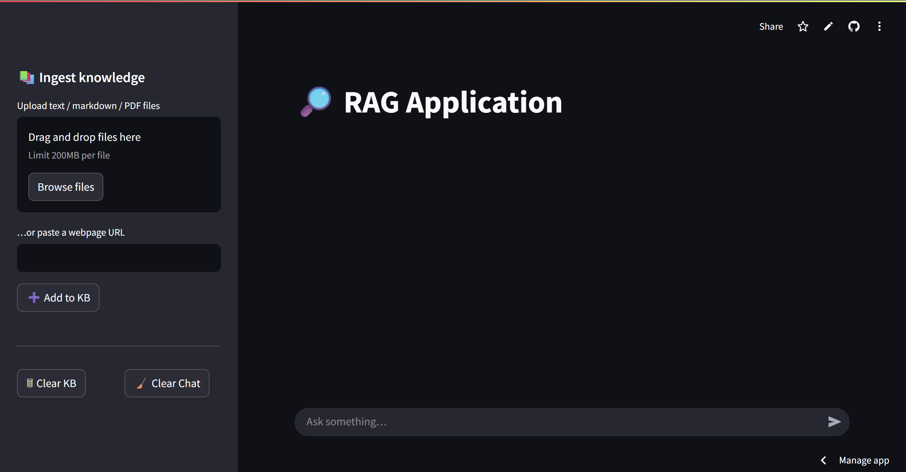

# RAG Application

A lightweight Retrieval‑Augmented Generation (RAG) chatbot that lets you:

* **Upload multiple documents** (TXT, Markdown, PDF¹) **or crawl a web page**
* **Chunk & embed** them with **Mistral embed** and store vectors in **FAISS**
* **Ask questions** that are answered strictly from your private knowledge base
* **Run locally** or **deploy to Streamlit Community Cloud** in minutes


---

## Demo

<p align="center">
  
</p>

---

## Requirements

| Tool                  | Version (tested)                   |
| --------------------- | ---------------------------------- |
| Python                | 3.9 – 3.12                         |
| `streamlit`           | ≥ 1.35.0                           |
| `mistralai` SDK       | ≥ 0.2.3                            |
| `langchain‑mistralai` | ≥ 0.0.10                           |
| `faiss‑cpu`           | ≥ 1.8.0                            |
| `unstructured[pdf]`   | *(only for PDF support, optional)* |

See **[`requirements.txt`](./requirements.txt)** for the full, pinned list.

---

## Environment variables

| Name              | Purpose                                                    |
| ----------------- | ---------------------------------------------------------- |
| `MISTRAL_API_KEY` | Your Mistral API key (required)                            |

> **Where to set them**
> *Local dev →* in your shell (or a `.env` file)
> *Streamlit Cloud →* *App → Settings → Secrets*.

---

## Local setup

```bash
# 1 . clone & cd into repo
git clone https://github.com/nagmudit/RAG-Application.git
cd RAG-Application

# 2 . create virtualenv & install deps
python -m venv .venv && source .venv/bin/activate   # Windows: .venv\Scripts\activate
pip install -r requirements.txt

# 3 . add your API key
export MISTRAL_API_KEY=sk‑...

# 4 . run the app
streamlit run app.py
```

Open [http://localhost:8501](http://localhost:8501) → upload docs / paste a URL → ask questions.

---

App is live at `https://rag-application-93zetneqmwxogjstaf83gv.streamlit.app`.

---

## Usage guide

1. **Ingest knowledge**
   *Drag‑drop files* (TXT/MD/PDF) **or** *paste a URL* and click **➕ Add to KB**.
2. **Chat**
   Type a question in the bottom chat box; answers cite snippets from your sources.
3. **Manage**
   *🗑 Clear KB* deletes all stored vectors; *🧹 Clear Chat* wipes the conversation.

> **Rate limits**
> The app retries automatically (exponential back‑off) on 429s, but if you exceed your Mistral quota, wait or upgrade.

---

## Folder structure

```
├─ app.py               # Streamlit front‑end & back‑end logic
├─ requirements.txt     # Python deps
├─ faiss_db/            # (generated) FAISS index + metadata
└─ assets/
   └─ screenshot.png     # optional demo image
```

---

## License

MIT © 2025 
